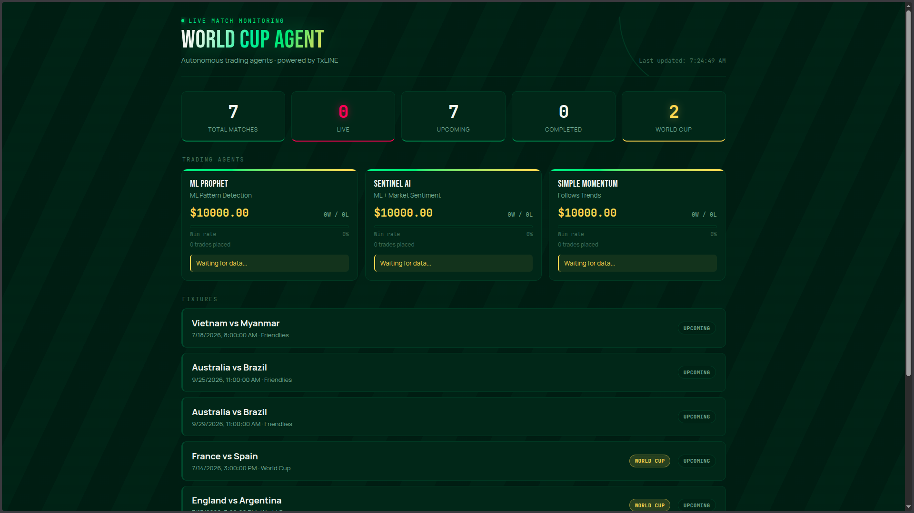
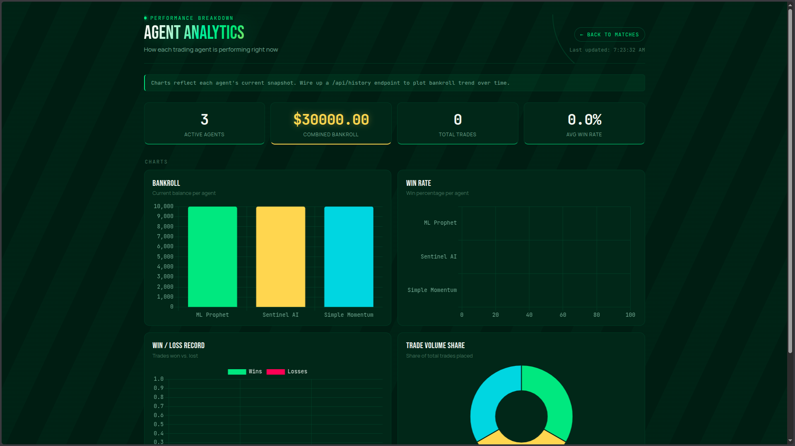

# TxLINE World Cup Agent

**Version:** 0.8.2

Autonomous multi-agent trading system built on TxLINE's live World Cup data feed. Three independent agents run competing strategies against the same real-time feed, with all decisions, bankrolls, and outcomes tracked and exposed through a live dashboard and Telegram alerts.

Built for Superteam's Trading Tools & Agents track (TxLINE World Cup Hackathon).

[](https://txline-worldcup-agent.vercel.app)
[](https://txline-worldcup-agent.vercel.app/analytics.html)
[](https://github.com/Freedomwithin/txline-worldcup-agent)
[](https://t.me/worldcup_agent_bot)

---

## Screenshots

### Live Dashboard


### Agent Analytics


---

## Overview

Three ML-driven agents read the same TxLINE feed and each execute an independent, fully automated strategy: no manual input is required once deployed. Every trade, win/loss outcome, and bankroll change is logged and served through a public API, so performance can be verified in real time rather than taken on faith.

**Live Dashboard:** [txline-worldcup-agent.vercel.app](https://txline-worldcup-agent.vercel.app)
**Analytics:** [txline-worldcup-agent.vercel.app/analytics.html](https://txline-worldcup-agent.vercel.app/analytics.html)
**Telegram Bot:** [@worldcup_agent_bot](https://t.me/worldcup_agent_bot)

---

## How It Works

```
TxLINE feed (fixtures + scores)
        │
        ▼
  server.js (polling + normalization)
        │
        ▼
  ML Agent Arena  ──►  3 independent agents evaluate the same snapshot
        │                  each executes its own strategy, no shared state
        ▼
  Agent state (bankroll, trades, win/loss) written per cycle
        │
        ├──► /api/matches   → live dashboard (fixtures, agent status, predictions)
        ├──► /api/history   → analytics dashboard (throttled 15-min snapshots)
        └──► Telegram Bot   → match alerts, leaderboard updates
```

Agents act independently on each polling cycle. There is no manual trade approval, override, or intervention step anywhere in the loop.

## Agents

| Agent | Signal | Strategy |
|-------|--------|----------|
| ML Prophet | Statistical pattern detection across match events | Flags recurring pre-shift patterns in scoring and momentum data, sized by confidence |
| Sentinel AI | ML pattern detection + market sentiment | Weights the same pattern signal against sentiment/consensus direction before acting |
| Simple Momentum | Trend following | Baseline agent — no pattern detection, used as a control to benchmark the other two against |

*Strategy detail and thresholds are documented in `src/ml_agent.js` and `src/ml_agent_arena.js`.*

---

## Dashboards

### Live Dashboard
- Real-time match monitoring with 30-second auto-refresh
- Match status indicators: live, soon, upcoming, completed
- **Next Match** countdown timer
- **Agent Leaderboard** showing top performing agent
- Agent predictions with confidence scores (BUY/SELL/HOLD)
- World Cup match badges and per-match event counts
- Per-agent status: bankroll, trade count, win/loss record, last action
- Click any match for detailed view with agent activity

### Analytics Dashboard
- Bankroll comparison across agents
- Win rate comparison
- Win/loss record breakdown
- Trade volume share
- Bankroll trend over time, sampled at 15-minute intervals via `/api/history`

### Telegram Bot

**Bot Icon:** Robot hand holding a holographic soccer ball with digital data particles - representing the fusion of AI agents and World Cup data.

- Live match alerts for World Cup fixtures
- Agent predictions sent directly to your phone
- Leaderboard updates showing top performing agent
- Real-time notifications without needing to check the dashboard

[Try it on Telegram](https://t.me/worldcup_agent_bot)al-time notifications without needing to check the dashboard

---

## Tech Stack

| Layer | Technology |
|-------|------------|
| Backend | Node.js, Express |
| Frontend | HTML, CSS, JavaScript, Chart.js |
| Data | TxLINE (Devnet) |
| Blockchain | Solana (Devnet) |
| Deployment | Vercel |
| Auth | JWT + API token |
| Notifications | Telegram Bot API |

---

## TxLINE Integration

| Endpoint | Used for |
|----------|----------|
| `/fixtures/snapshot` | Current fixture state, pulled each polling cycle |
| `/scores/historical/{fixtureId}` | Historical score data feeding the pattern detector |

**Feedback on the TxLINE API:** *[Fill in — required by the submission. Note what was smooth (e.g. normalized schema across competitions) and any friction points, such as forward fixture coverage or rate limits, honestly. Judges explicitly ask for this — a candid answer reads better than a glowing one.]*

---

## Project Structure

```
txline-arena-agent/
├── api/
│   └── server.js              # API layer: polling, ML agents, history endpoint
├── public/
│   ├── index.html              # Live dashboard with predictions and leaderboard
│   ├── analytics.html          # Analytics dashboard
│   └── assets/
│       └── u.i_screenshots/    # Screenshots for README
│           ├── dashboard.png
│           └── agent_analytics.png
├── src/
│   ├── ml_agent.js             # Pattern detection logic with FIFA rankings
│   ├── ml_agent_arena.js       # Multi-agent orchestration
│   ├── history.js              # Throttled snapshot storage
│   ├── onchain_settlement.js   # Solana devnet settlement
│   ├── telegram_bot.js         # Telegram bot integration
│   └── ...
├── data/
│   ├── team_rankings.json      # FIFA rankings reference data
│   ├── historical_matches.json
│   └── history.json            # Agent snapshot history
├── package.json
├── vercel.json
├── README.md
└── CHANGELOG.md
```

---

## Installation

```bash
git clone https://github.com/Freedomwithin/txline-worldcup-agent.git
cd txline-worldcup-agent
npm install
cp .env.example .env
# Add TxLINE credentials and Telegram bot token to .env
```

## Deployment

```bash
vercel --prod
```

---

## Telegram Bot Setup

1. Create a bot with [@BotFather](https://t.me/BotFather)
2. Get your bot token
3. Get your chat ID by sending a message to the bot
4. Add `TELEGRAM_BOT_TOKEN` and `TELEGRAM_CHAT_ID` to `.env`

---

## Changelog

See [CHANGELOG.md](./CHANGELOG.md) for full version history.

| Version | Date | Key Features |
|---------|------|--------------|
| 0.8.2 | 2026-07-13 | Telegram bot integration, match alerts, leaderboard updates |
| 0.8.1 | 2026-07-13 | Fixed analytics navigation, enhanced UI |
| 0.8.0 | 2026-07-13 | Next Match countdown, Leaderboard, Confidence scores |
| 0.7.0 | 2026-07-13 | On-chain settlement, Match Detail Modal |
| 0.6.0 | 2026-07-13 | UI Overhaul, Analytics Dashboard |

---

## License

MIT © 2026 Jonathon Koerner

---

Built for the TxLINE World Cup Hackathon.
